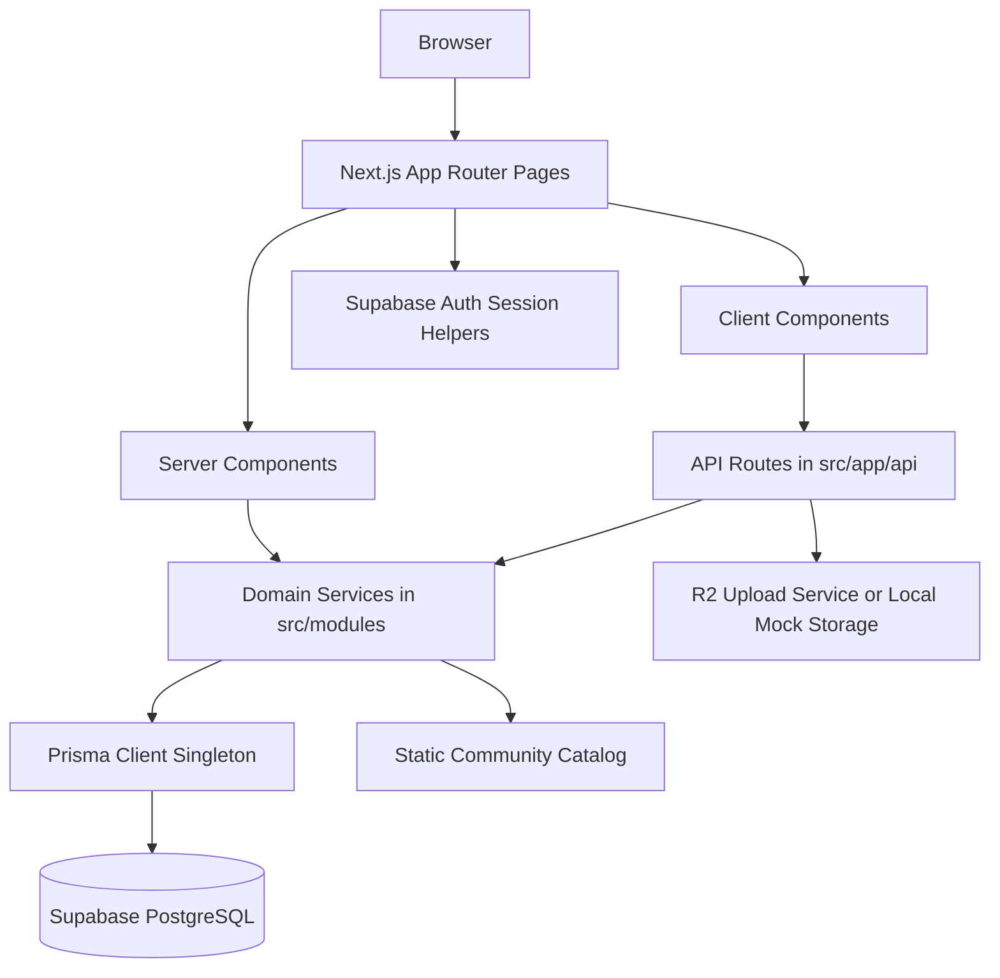
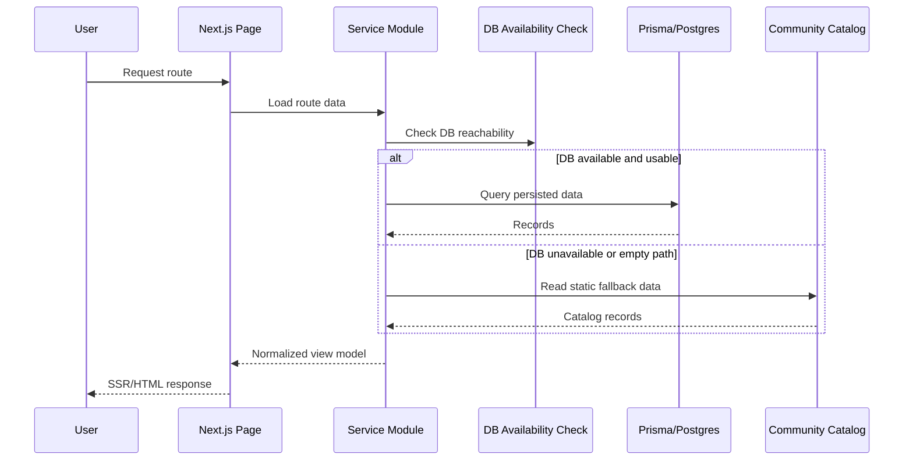
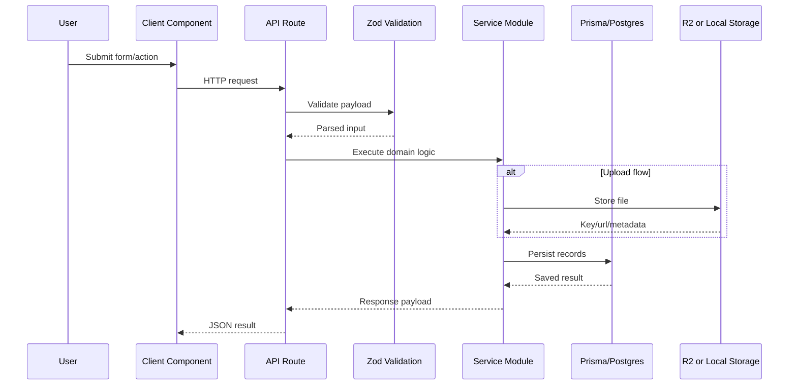
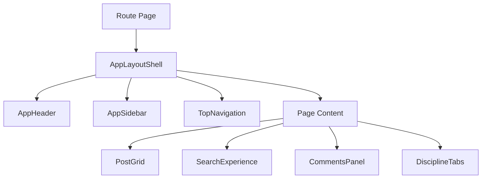
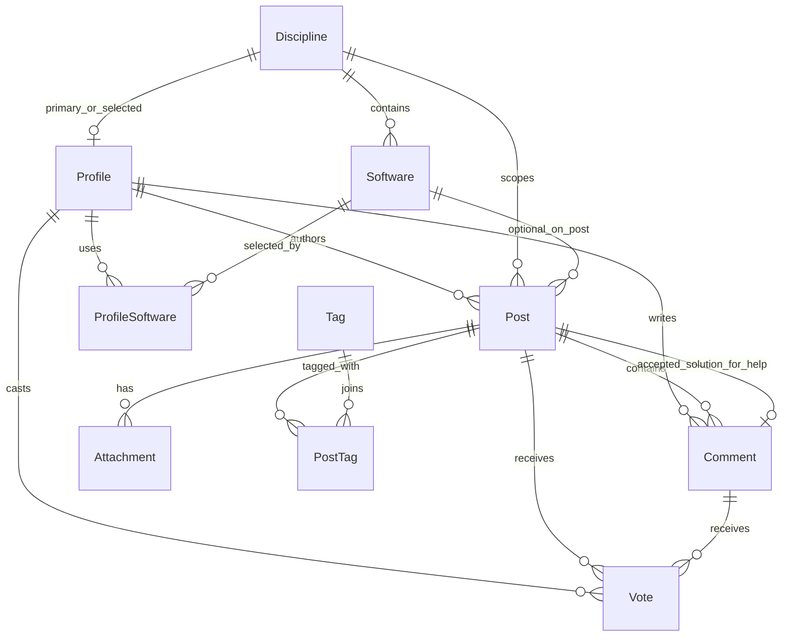

# ARCHITECTURE

## Scope
This architecture document describes the current application architecture only. It reflects the repository structure and runtime patterns present in the codebase as of 2026-06-20.

## Application Architecture
The repository is a Next.js App Router application organized around route-level server components, domain service modules, and UI component families. It uses a hybrid runtime data model:

- primary path: Prisma + Supabase/PostgreSQL
- fallback path: static community catalog data and limited in-memory-style fallback stores when database availability checks fail



## Frontend Architecture
### Route layer
The frontend is centered in `src/app/`.

- route pages are largely server components
- interactive surfaces are delegated to client components
- loading files exist for selected heavy routes
- metadata generation happens at route level for SEO-sensitive pages

### Layout composition
There are two main visual shells:

- global app shell via `src/app/layout.tsx`
- community page composition via `src/components/ui-system/app-layout-shell.tsx`

`AppLayoutShell` composes:
- `AppHeader`
- `AppSidebar`
- `TopNavigation`
- themed overlay/background layers

### UI families
The UI is split into clear families:
- `src/components/ui`: primitive building blocks
- `src/components/forum`: search, comments, grids, tabs, empty/loading states
- `src/components/cards`: post-type-specific listing cards
- `src/components/editor`: post creation form
- `src/components/upload`: upload widget
- `src/components/v0/*`: imported premium surfaces for hero, auth, dashboard, and profile

### Visual architecture
The visual system is layered rather than singular:
- base system from Tailwind + CSS variables in `src/app/globals.css`
- premium imported surface treatment in `src/app/v0-surfaces.css`
- page-specific v0 preview CSS in `src/app/(v0-import)/v0-preview/v0-preview.css`

## Backend Architecture
### API route layer
Backend HTTP entry points live in `src/app/api/*`.

Patterns:
- each route validates input with Zod-backed schemas where applicable
- routes call domain services in `src/modules/*/server`
- routes usually return structured JSON success/error payloads
- some write routes apply rate limiting
- some routes include development/testing fallback auth behavior through a `mock-valid-token` cookie shortcut

### Domain service layer
Business logic is organized by module:
- `auth`
- `comments`
- `dashboard`
- `feed`
- `help`
- `posts`
- `profiles`
- `reputation`
- `search`
- `stats`
- `tags`
- `uploads`
- `votes`

This is the main backend boundary in the repository.

### Persistence layer
Persistence is implemented through:
- Prisma schema in `prisma/schema.prisma`
- Prisma client singleton in `src/server/db/client.ts`
- soft-delete query extension in `src/server/db/soft-delete.ts`
- connection safety adjustments for Supabase pooling in the Prisma client bootstrap

### External services
- Supabase Auth for authentication
- Supabase PostgreSQL for data
- Cloudflare R2 for uploads when mock mode is off
- Upstash rate limiting when relevant environment variables are present

## Data Flow
### Read path


### Write path


## Component Hierarchy
### Community pages


### Landing page
```mermaid
flowchart TD
    A[/ page.tsx] --> B[LandingPage]
    B --> C[Hero Section]
    B --> D[Signals Section]
    B --> E[Critiques Section]
    B --> F[Work Section]
    B --> G[Magic Bento]
    B --> H[Join Section]
```

### Dashboard page
```mermaid
flowchart TD
    A[/dashboard] --> B[DashboardPage]
    B --> C[StudioHeader]
    B --> D[Overview Panels]
    B --> E[Feed Columns]
    B --> F[Practice Stack Panel]
    B --> G[Notifications Placeholder]
    B --> H[Quick Routes]
```

### Profile page
```mermaid
flowchart TD
    A[/profile/[username]] --> B[AtelierProfilePage]
    B --> C[ProfileNav]
    B --> D[Craft Momentum Panel]
    B --> E[Community Pulse Panel]
    B --> F[Growth Signal Panel]
    B --> G[Activity Heatmap]
    B --> H[Practice Archive]
    B --> I[Mentorship Lane]
    B --> J[Recognition]
```

## API Architecture
### API categories
- authentication initiation: `/api/auth/google`, `/api/auth/magic-link`
- posts: `/api/posts`, `/api/posts/[slug]`
- comments: `/api/comments`, `/api/comments/[commentId]`
- help solved flow: `/api/help/solution`
- profiles: `/api/profiles/me`, `/api/profiles/[username]`
- search and discovery: `/api/search`, `/api/stats`, `/api/tags`
- uploads: `/api/uploads`, `/api/uploads/[...key]`
- voting: `/api/votes`
- onboarding: `/api/onboarding`

### Common route pattern
1. parse request and session context
2. validate input with Zod or manual guards
3. call module service
4. normalize response
5. return structured JSON or error payload

### Security-related route patterns present
- route-level auth checks via Supabase session or helper wrappers
- middleware protection on selected route prefixes
- rate limiting on selected write endpoints
- sanitization utilities used in post/profile services

### Non-uniformity present
The API layer is not completely uniform. Some routes use shared error helpers, while others implement inline error mapping and development fallback auth logic.

## Authentication Architecture
### Components
- browser Supabase client: `src/lib/supabase/client.ts`
- server Supabase client: `src/lib/supabase/server.ts`
- middleware: `middleware.ts`
- auth redirect logic: `src/modules/auth/server/auth-redirect.ts`
- auth requirement helpers: `src/lib/auth/require-auth.ts`

### Flow
```mermaid
flowchart TD
    A[Login or Signup Page] --> B[Google OAuth or Magic Link API]
    B --> C[Supabase Auth]
    C --> D[/auth/callback]
    D --> E[resolvePostAuthRedirect]
    E -->|Not onboarded| F[/onboarding]
    E -->|Onboarded| G[/dashboard]
    H[Middleware] --> I{Protected path?}
    I -->|Yes and no session| A
    I -->|Yes and session| J[Continue]
```

### Auth model notes
- auth identity is externalized to Supabase
- application profile data is stored in Prisma `Profile`
- onboarding completion is application-level, not auth-provider-level
- several API routes still contain mock-cookie auth shortcuts for testing/development

## Database Relationships
### Core relationships


### Schema characteristics in practice
- `Post` is a single-table multi-post-type model
- `Comment` may be designated as solution for help posts
- `Vote` is polymorphic by target type using nullable `postId` and `commentId`
- `ProfileSoftware` supports many-to-many profile/tool selection
- `PostTag` supports many-to-many post/tag assignment

## State Management Architecture
### Server state
- initial page data is fetched in server components
- Prisma-backed services provide normalized data
- DB availability checks can reroute to fallback data paths

### Client state
- React local state for comments, uploads, filters, and preview modes
- RHF for complex form state
- URL state for search filters and page query params
- localStorage draft state in post creation
- no global client-side state manager found

### Hybrid runtime consequence
The application can render even when the DB is not healthy, but some paths degrade to non-authoritative catalog data. This is a deliberate resilience pattern in the current codebase.

## Animation Architecture
### Motion stack
- GSAP drives hero and imported premium section motion
- Framer Motion is used in selected premium UI components
- CSS overlays, gradients, noise layers, and panel treatments carry much of the visual atmosphere elsewhere

### Motion concentration
Most advanced motion lives in:
- `src/components/v0/hero/*`
- imported preview surfaces

Community utility pages rely more on static premium styling than complex animation.

## Deployment Assumptions In Code
### Environment assumptions
The code expects at least:
- `NEXT_PUBLIC_APP_URL`
- `DATABASE_URL`
- `NEXT_PUBLIC_SUPABASE_URL`
- `NEXT_PUBLIC_SUPABASE_ANON_KEY`
- `SUPABASE_SERVICE_ROLE_KEY`

Optional environment groups are present for:
- R2 upload configuration
- local mock upload mode
- Upstash rate limiting

### Build/runtime assumptions
- Next.js server rendering is central to route behavior
- Prisma client is configured to be singleton and Supabase-pooler-safe
- uploads can run against external object storage or local mock files
- some SEO assets such as sitemap still derive from catalog data rather than guaranteed live DB state

## Architectural Strengths Present In Current Code
- clear module-based domain organization
- Prisma singleton and soft-delete extension
- SSR-first route architecture
- typed schemas and validation in critical flows
- resilient fallback path when DB is unavailable
- imported premium UI isolated into component families rather than spread ad hoc

## Architectural Constraints Present In Current Code
- fallback catalog remains intertwined with authoritative data paths
- some navigation and taxonomy sourcing are still static
- some profile/dashboard panels are presentational composites rather than purely domain-driven views
- API route conventions are not fully standardized
- root `Tests/` and `src/__tests__/` test layouts are mixed
