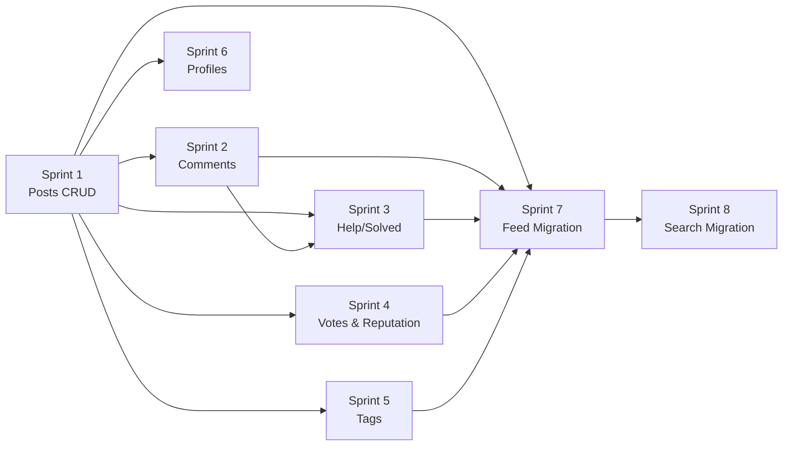

# Backend Persistence — Full Implementation Plan

## Overview

The Designers Hub frontend is built and functional, but most data flows run on **mock data** (`community-data.ts`) or **in-memory stores** (`globalThis` Maps). The database schema, Prisma client, and Supabase auth are all wired up — but only onboarding actually writes to PostgreSQL.

This plan converts every mock/in-memory layer to **persistent Prisma-backed services** and builds the missing API surface (votes, tags, profiles).

---

## Current State vs Target State

| Domain | Current | Target |
|--------|---------|--------|
| **Posts** | 9 hardcoded posts in `community-data.ts` | Full CRUD via Prisma + API routes |
| **Comments** | In-memory `Map<string, CommentRecord[]>` | Prisma `comments` table |
| **Help/Solved** | In-memory `Map<string, HelpSolutionState>` | Prisma `posts.isSolved` + `acceptedCommentId` |
| **Votes** | ❌ Not implemented | Prisma `votes` table + API |
| **Tags** | Schema exists, no API | Tag CRUD + post-tag association |
| **Profiles** | Only onboarding writes | Read/edit API + reputation |
| **Search** | Searches over 9 mock posts | PostgreSQL full-text search |
| **Feed/Discovery** | Direct import from `community-data.ts` | Server-side Prisma queries |
| **Uploads** | R2 + mock mode (works) | Add auth guard, link to posts |

---

## User Review Required

> [!IMPORTANT]
> **Database access**: This plan assumes you have a running Supabase PostgreSQL instance and your `.env` file has valid `DATABASE_URL`, `NEXT_PUBLIC_SUPABASE_URL`, and `NEXT_PUBLIC_SUPABASE_ANON_KEY` values. We'll need to run `npx prisma migrate dev` to apply the schema. Please confirm your database is accessible.

> [!IMPORTANT]
> **Seed data**: The current `prisma/seed.js` seeds disciplines and softwares. We'll extend it to seed sample posts, comments, and tags so the app has content to display after migration. This replaces the hardcoded mock data.

> [!WARNING]
> **Breaking change to frontend data flow**: Once we replace mock imports with real API/server-action calls, the app will require a running database to function. The mock `community-data.ts` file will be kept as reference but no longer imported by pages.

---

## Open Questions

> [!IMPORTANT]
> **1. Pagination strategy**: The current mock feed shows all 9 posts. For real data, I recommend cursor-based pagination for feeds (better performance at scale) and offset pagination for search. Does this work for you, or do you prefer offset everywhere?

> [!IMPORTANT]
> **2. Soft delete vs hard delete**: Should posts/comments be soft-deleted (`deletedAt` timestamp) or hard-deleted? Soft delete is safer and allows moderation review. This would require a small schema migration to add `deletedAt` columns.

> [!IMPORTANT]
> **3. Post editing**: The current schema supports post editing (has `updatedAt`), but should authors be able to edit posts after comments/votes exist? Any restrictions?

> [!IMPORTANT]
> **4. Algolia search**: The spec mentions Algolia for search. For this sprint, I plan to implement PostgreSQL full-text search (`tsvector`/`tsquery`) as the initial backend. This is production-viable and avoids adding a paid external dependency now. Algolia can be swapped in later. Sound good?

---

## Proposed Changes

### Sprint 1 — Posts Service & API

The foundation. Everything else depends on posts being in the real database.

---

#### [NEW] `src/modules/posts/server/post-service.ts`

Core CRUD service for posts. All functions take validated inputs and return typed results.

**Functions:**
- `createPost(authorId, input)` — Creates post + attachments + tags in a Prisma transaction. Generates URL-safe slug from title. Returns the created post.
- `getPostBySlug(slug)` — Fetches a single post with author profile, discipline, software, attachments, tags. Increments `viewCount` atomically.
- `listPosts(filters)` — Paginated post listing with filters: `discipline`, `postType`, `software`, `sortBy` (newest/trending/top). Returns `{ posts, nextCursor, total }`.
- `updatePost(postId, authorId, input)` — Author-only update. Validates ownership.
- `deletePost(postId, authorId)` — Author-only delete. Cascades to attachments (via schema).

**Slug generation**: `slugify(title) + "-" + shortId(6)` — e.g. `"best-workflow-presentations-2026-a3f9b2"`.

---

#### [NEW] `src/modules/posts/server/post-queries.ts`

Reusable Prisma query fragments for common post includes/selects. Keeps the service layer DRY.

**Exports:**
- `postWithRelations` — Standard include: `{ author: true, discipline: true, software: true, attachments: true, tags: { include: { tag: true } } }`
- `postListSelect` — Lightweight select for feed cards (no full body)
- `mapPostToResponse(prismaPost)` — Maps Prisma result to a clean API response shape

---

#### [NEW] `src/modules/posts/schemas/post-api-schema.ts`

Zod schemas for post API request/response validation.

**Schemas:**
- `postListQuerySchema` — `{ discipline?, postType?, software?, sortBy?, cursor?, pageSize? }`
- `postUpdateSchema` — Subset of creation fields that can be edited
- `postResponseSchema` — Shape of API response for a single post

---

#### [NEW] `src/app/api/posts/route.ts`

**Methods:** `GET` (list posts), `POST` (create post)

- `GET`: Public. Accepts query params for filtering/pagination. Returns paginated post list.
- `POST`: **Auth required**. Validates body against `postCreationSchema`. Calls `createPost`. Returns created post with `201`.

---

#### [NEW] `src/app/api/posts/[slug]/route.ts`

**Methods:** `GET` (single post), `PATCH` (update), `DELETE`

- `GET`: Public. Returns full post with relations. Increments view count.
- `PATCH`: **Auth required**. Author-only. Validates update payload.
- `DELETE`: **Auth required**. Author-only. Returns `204`.

---

#### [NEW] `src/lib/utils/slug.ts`

Slug generation utility. `generateSlug(title: string): string` — lowercases, replaces non-alphanumeric with hyphens, appends 6-char random suffix for uniqueness.

---

### Sprint 2 — Comments Persistence

---

#### [NEW] `src/modules/comments/server/comment-service.ts`

Replaces the in-memory `comment-store.ts`.

**Functions:**
- `listCommentsByPost(postId, { cursor?, pageSize? })` — Paginated comments with author profiles. Sorted by `createdAt ASC`.
- `createComment(postId, authorId, body)` — Creates comment, increments `Post.commentCount` atomically in a transaction. Returns comment with author.
- `deleteComment(commentId, authorId)` — Author-only delete. Decrements `Post.commentCount`.
- `getCommentById(commentId)` — Used by help/solved system.

---

#### [MODIFY] `src/app/api/comments/route.ts`

- Switch from `comment-store` imports to `comment-service` imports.
- `GET`: Change param from `postSlug` to `postId` (or support both with a DB lookup).
- `POST`: Keep auth check, use new service. Return `201` with comment.

---

#### [DELETE] `src/modules/comments/server/comment-store.ts`

Replaced by `comment-service.ts`. Remove after migration.

---

### Sprint 3 — Help / Solved Persistence

---

#### [NEW] `src/modules/help/server/help-solution-service.ts`

Replaces the in-memory `help-solution-store.ts`. Operates directly on the `posts` table.

**Functions:**
- `getHelpSolutionState(postSlug)` — Reads `isSolved` and `acceptedCommentId` from the post. Returns `HelpSolutionState`.
- `setHelpSolution(postSlug, commentId, userId)` — Validates: post exists, post is `help` type, user is the post author (only author can accept answers). Sets `Post.acceptedCommentId` and `Post.isSolved = true`. Marks `Comment.isSolution = true`.
- `clearHelpSolution(postSlug, userId)` — Author unmarks the accepted answer. Sets `isSolved = false`, clears `acceptedCommentId`.

---

#### [MODIFY] `src/app/api/help/solution/route.ts`

- Remove import of `getPostBySlug` from `community-data.ts`.
- Switch to `help-solution-service` imports.
- Add author-only validation for POST (only the help post author can mark solved).

---

#### [DELETE] `src/modules/help/server/help-solution-store.ts`

Replaced by `help-solution-service.ts`.

---

### Sprint 4 — Votes & Reputation

---

#### [NEW] `src/modules/votes/schemas/vote-schema.ts`

**Schemas:**
- `postVoteSchema` — `{ postId: string, voteType: "up" | "down" }`
- `commentVoteSchema` — `{ commentId: string, voteType: "up" | "down" }`

---

#### [NEW] `src/modules/votes/server/vote-service.ts`

**Functions:**
- `voteOnPost(authorId, postId, voteType)` — Upserts vote. If same vote exists, removes it (toggle). If opposite vote exists, flips it. Updates `Post.voteCount` atomically. All in a transaction.
- `voteOnComment(authorId, commentId, voteType)` — Same pattern for comments, updates `Comment.voteCount`.
- `getUserVotes(authorId, postIds?, commentIds?)` — Returns the user's existing votes for a set of targets (for UI state).

**Vote count logic:**
- New upvote: `voteCount += 1`
- Remove upvote (toggle): `voteCount -= 1`
- Flip down→up: `voteCount += 2`
- New downvote: `voteCount -= 1`
- Remove downvote (toggle): `voteCount += 1`
- Flip up→down: `voteCount -= 2`

---

#### [NEW] `src/app/api/votes/route.ts`

**Methods:** `POST` (cast/toggle vote), `GET` (get user's votes for targets)

- `POST`: **Auth required**. Accepts `{ targetType: "post" | "comment", targetId, voteType }`.
- `GET`: **Auth required**. Accepts `postIds` and/or `commentIds` as query params. Returns user's current vote state.

---

#### [NEW] `src/modules/reputation/server/reputation-service.ts`

**Functions:**
- `recalculateReputation(userId)` — Queries all reputation-earning events for a user and updates `Profile.reputation`. Called after vote changes, accepted answers, etc.

**Reputation rules** (from AGENTS.md):
| Event | Points |
|-------|--------|
| Accepted answer (help) | +5 |
| Critique contribution | +3 |
| Helpful comment (upvoted) | +2 |
| Upvote received on post | +2 |
| Discussion participation | +1 |

---

### Sprint 5 — Tags

---

#### [NEW] `src/modules/tags/server/tag-service.ts`

**Functions:**
- `findOrCreateTags(tagNames: string[])` — For each tag name, finds existing or creates new. Returns array of tag records. Used during post creation.
- `getPopularTags(disciplineSlug?, limit?)` — Returns most-used tags, optionally filtered by discipline.
- `searchTags(query: string, limit?)` — Autocomplete for tag input.

---

#### [NEW] `src/app/api/tags/route.ts`

**Methods:** `GET` (list/search tags)

- Accepts `?q=` for autocomplete search, `?discipline=` for filtering, `?popular=true` for trending tags.

---

#### [MODIFY] `src/modules/posts/server/post-service.ts`

Update `createPost` to call `findOrCreateTags` and create `PostTag` join records in the same transaction.

---

### Sprint 6 — Profiles API

---

#### [NEW] `src/modules/profiles/server/profile-service.ts`

**Functions:**
- `getProfileByUsername(username)` — Returns profile with disciplines, softwares, post count, reputation. Public-facing.
- `getProfileById(userId)` — Internal use (for auth context).
- `updateProfile(userId, input)` — Update bio, avatar, display name. Validates username uniqueness if changed.
- `getProfileStats(userId)` — Returns `{ postCount, commentCount, acceptedAnswerCount, reputation }`.

---

#### [NEW] `src/modules/profiles/schemas/profile-schema.ts`

**Schemas:**
- `profileUpdateSchema` — `{ username?, bio?, avatarUrl? }`
- `profileResponseSchema` — Public profile shape

---

#### [NEW] `src/app/api/profiles/[username]/route.ts`

**Methods:** `GET` (public profile)

---

#### [NEW] `src/app/api/profiles/me/route.ts`

**Methods:** `GET` (current user profile), `PATCH` (update profile)

- Both **auth required**.

---

### Sprint 7 — Feed & Discovery (Replace Mock Data)

This is where we **cut over** from `community-data.ts` to real database queries.

---

#### [NEW] `src/modules/feed/server/feed-service.ts`

Server-side data fetching functions designed to be called from Server Components (no API route needed — direct Prisma access in RSC).

**Functions:**
- `getHomeFeed()` — Returns `{ trendingDiscussions, critiqueRequests, featuredShowcases, solvedHelp, weeklyResources }` — same shape as `getHomeSections()` from mock data, but from real DB.
- `getDisciplineFeed(disciplineSlug, postType?, cursor?, pageSize?)` — Paginated posts for a discipline hub page.
- `getThreadBySlug(slug)` — Full post with comments, author, vote counts — for thread detail page.

---

#### [MODIFY] `src/app/page.tsx`

Replace `import { getHomeSections } from "@/lib/mock/community-data"` with `import { getHomeFeed } from "@/modules/feed/server/feed-service"`. Data shape stays compatible so card components don't need changes.

---

#### [MODIFY] `src/app/[discipline]/page.tsx` and sub-pages

Replace mock data imports with `getDisciplineFeed` calls. Same pattern for `/discussions`, `/critique`, `/showcase`, `/help`, `/resources` pages.

---

#### [MODIFY] `src/app/thread/[slug]/page.tsx`

Replace `getPostBySlug` mock import with `getThreadBySlug` from feed service.

---

#### [MODIFY] `src/app/explore/page.tsx`

Wire up to real discipline data from DB instead of mock `disciplines` array.

---

### Sprint 8 — Search Migration

---

#### [MODIFY] `src/modules/search/server/search-service.ts`

Complete rewrite. Replace mock data search with PostgreSQL full-text search.

**Approach:**
1. Add a migration to create a `search_vector` `tsvector` column on `posts` with a GIN index.
2. Populate `search_vector` via a trigger on INSERT/UPDATE (concatenates `title`, `body`, and type-specific fields).
3. `searchPosts(query)` uses `tsquery` for text matching, with the same filter support (discipline, software, postType, solved).
4. Ranking uses `ts_rank_cd` combined with engagement and freshness signals.
5. Remove the in-memory cache (DB queries with proper indexes are fast enough, and results are always fresh).

---

#### [NEW] `prisma/migrations/YYYYMMDD_search_vector/migration.sql`

Migration to add:
- `search_vector tsvector` column on `posts`
- GIN index on `search_vector`
- Trigger function to auto-populate on INSERT/UPDATE

---

### Cross-Cutting Concerns

---

#### [NEW] `src/lib/auth/require-auth.ts`

Shared auth helper to reduce boilerplate across API routes.

```ts
export async function requireAuth(): Promise<{ userId: string; user: User }>
// Throws 401 if not authenticated
```

---

#### [MODIFY] `src/app/api/uploads/route.ts`

Add auth guard — currently **anyone can upload files** (security hole).

---

#### [NEW] `src/lib/utils/pagination.ts`

Shared pagination utilities:
- `parseCursor(cursor: string): { id: string, createdAt: Date }`
- `encodeCursor(post: { id, createdAt }): string`
- Cursor is a base64-encoded `id:timestamp` pair.

---

#### [MODIFY] `prisma/seed.js`

Extend seed script to create:
- Sample posts across all 5 types and 3 disciplines (15-20 posts)
- Sample comments (3-5 per post)
- Sample tags and post-tag associations
- Sample votes

This ensures the app has content after migration.

---

## Sprint Execution Order



**Sprint 1** is the only hard prerequisite. Sprints 2-6 can be worked in parallel after Sprint 1. Sprint 7 (feed migration) depends on all services being ready. Sprint 8 comes last.

---

## Files Summary

| Action | Count | Files |
|--------|-------|-------|
| **NEW** | 18 | `post-service.ts`, `post-queries.ts`, `post-api-schema.ts`, `posts/route.ts`, `posts/[slug]/route.ts`, `slug.ts`, `comment-service.ts`, `help-solution-service.ts`, `vote-schema.ts`, `vote-service.ts`, `votes/route.ts`, `reputation-service.ts`, `tag-service.ts`, `tags/route.ts`, `profile-service.ts`, `profile-schema.ts`, `profiles/[username]/route.ts`, `profiles/me/route.ts`, `require-auth.ts`, `pagination.ts`, `feed-service.ts`, search migration |
| **MODIFY** | 9 | `comments/route.ts`, `help/solution/route.ts`, `uploads/route.ts`, `seed.js`, `page.tsx` (home), `[discipline]` pages, `thread/[slug]/page.tsx`, `explore/page.tsx`, `search-service.ts` |
| **DELETE** | 2 | `comment-store.ts`, `help-solution-store.ts` |

---

## Verification Plan

### Automated Tests
After each sprint, verify with:
```bash
npx prisma migrate dev          # Schema migrations apply cleanly
npx prisma db seed              # Seed data populates correctly
npm run typecheck               # No TypeScript errors
npm run build                   # Production build succeeds
npm run dev                     # Dev server starts, pages render
```

### Manual API Testing
For each new API route, verify with curl/Postman:
- `POST /api/posts` — create a post (with auth header)
- `GET /api/posts` — list posts with filters
- `GET /api/posts/[slug]` — single post with relations
- `POST /api/comments` — create comment
- `POST /api/votes` — cast vote, verify toggle behavior
- `GET /api/profiles/[username]` — public profile

### Integration Verification
- Home page renders posts from DB (not mock data)
- Discipline pages show filtered posts
- Thread pages show real comments
- Search returns real results
- Help posts can be marked solved
- Vote counts update correctly
